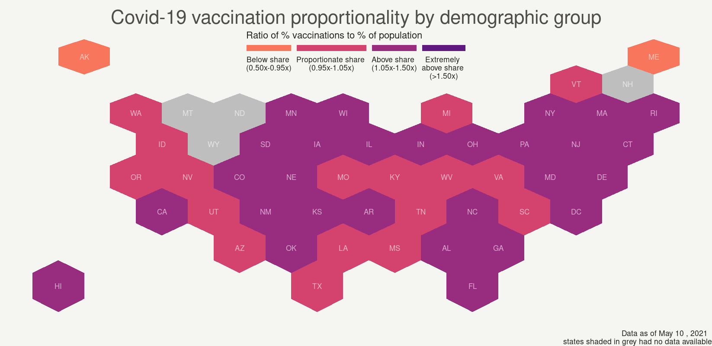
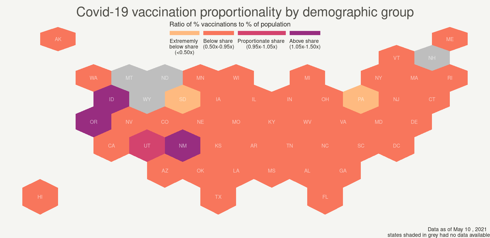
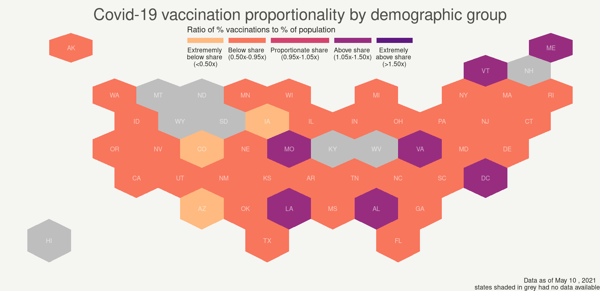
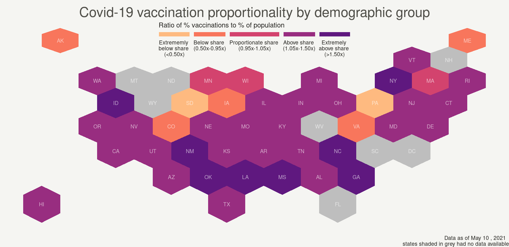
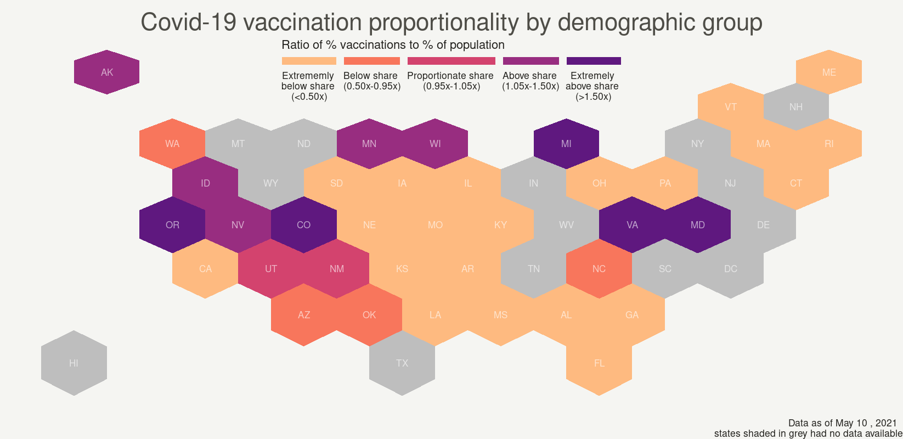
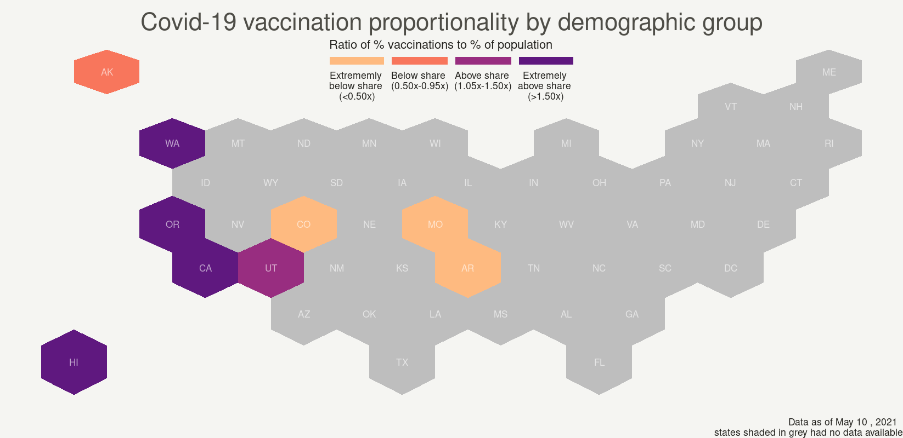

```{r setup, include=FALSE}
knitr::opts_chunk$set(echo = TRUE, fig.align="center")
library(tidyverse)
library(readr)
library(janitor)
library(naniar)
library(geojsonio)
library(broom)
library(rgeos)
library(shiny)
library(shinythemes)
library(shinyjs)
library(DT)
library(datasets)
library(viridis)
library(maps)
library(leaflet)
library(tigris)
```

# Introduction

The Covid-19 pandemic continues to highlight inequality in health outcomes in the United States.  As of April 23rd, 2021, the [CDC](https://www.cdc.gov/coronavirus/2019-ncov/covid-data/investigations-discovery/hospitalization-death-by-race-ethnicity.html#footnote02) reports that Hispanic, Black, and American Indian or Alaska Native people are more likely to test positive for, be hospitalized for, and die from Covid-19 when compared to White, non-Hispanic people.  Considering these disparities alongside recent developments in vaccine distribution, we became curious as to how race and ethnicity relate to immunization rates in each state.

Various data sources have presented vaccination progress in terms of each state’s efficiency (use of allocated vaccines) and speed (proportion of population that is vaccinated).  We have developed a range of visualizations to consider how race and ethnicity relate to vaccine progress in the United States. 

# Are states vaccinating demographic groups proportionally to their share of the population?

One of our goals was to make a visualization to see whether demographic groups were receiving their share of Covid-19 vaccines.  We present this using a Hexbin map --a 2-D density technique where each state is represented with a hexagon - following an example by [Yan Holtz of The R Graph Gallery](https://www.r-graph-gallery.com/328-hexbin-map-of-the-usa.html).  The Kaiser Family Foundation [(KFF)](https://www.kff.org/other/state-indicator/covid-19-vaccinations-by-race-ethnicity/?currentTimeframe=0&sortModel=%7B%22colId%22:%22Location%22,%22sort%22:%22asc%22%7D) collects data on the percentage of vaccines that have been distributed to six racial and ethnic group. They began publishing this on March 1, 2021 and have recently been re-publishing this weekly.  [KFF](https://www.kff.org/other/state-indicator/distribution-by-raceethnicity/) also maintains a dataset of population distribution by race and ethnicity in each state.   We developed a “demographic metric” comparing these two values to be able to indicate whether demographic groups were receiving a proportionate share of vaccinations: 

```{r, include=FALSE}
# see KFF_vax_wrangling.R for data wrangling
```

<center> 
Demographic Metric =  <math><mfrac><mi>% of vaccines that went to a given group in a state</mi><mi>% of state population that is made up of that group</mi></mfrac></math>
</center> 

To make this value easier to interpret, we set cutoff values such that demographic metrics were categorized (and colored accordingly) into extremely below share, below share, proportionate share, above share, and extremely above share.

```{r, echo=FALSE}
# Ex: categorizing the demographic metric for those that are White

# mutate(white_metric_cat = cut(white_metric, 
#                                breaks = c(-1, 0.5, 0.95, 1.05, 1.5, 10),
#                                labels = c("Extremely below share (<0.50x)", 
#                                           "Below share (0.50x-0.95x)", 
#                                           "Proportionate share (0.95x-1.05x)",
#                                           "Above share (1.05x-1.50x)",
#                                           "Extremely above share (>1.50x)"))
```

The KFF data begins on March 1, 2021, when states had varying restrictions regarding vaccine eligibility, and spans several weeks past April 19, the date when all adults became eligible in every US state.  This [Shiny App](https://cuseda23.shinyapps.io/final_blog_post/) allows users to select a demographic group and date of interest. 

```{r, include=FALSE }
# see app.R for Shiny App code
```

Looking at each demographic group, we can observe some shifts in the number of states (51 including D.C.) reporting data by race and ethnicity (from March 1, 2021 to May 10, 2021) as well as vaccine distribution proportionality: 

# {.tabset .tabset-fade .tabset-pills}

## Overview
Across the country and over time, White and Asian people are receiving more than their share of vaccines, while Black and Hispanic people are receiving less than their share.  American Indians or Alaska Natives and Native Hawaiians or Other Pacific Islanders are also generally receiving less than their share, though data is more sparse for these groups. Vaccine distribution for all demographic groups except American Indians or Alaska Natives has become more equitable over time in terms of moving away from either “extremely below share” or “extremely above share.” 

## White 
* 10 states (20%) missing on March 1, 2021 - 4 states (8%) missing on May 10, 2021
* Shift to more states distributing a “proportionate share” of vaccines to those who are White over time, though the Northeastern region continues to fall into “above share” category


## Black 
* 10 states (20%) missing on March 1, 2021 - 4 states (8%) missing on May 10, 2021
* Earlier maps show most states at “extremely below share” or “below share”, while later maps shift to mostly “below share” with only South Dakota and Pennsylvania at “extremely below share”
* Vermont is consistently below share, despite [April eligibility criteria](https://khn.org/news/article/vermont-gives-blacks-and-other-minority-residents-vaccine-priority/) that allowed people of color to be able to register for a vaccine before the general adult population


## Hispanic
* 15 states (29%) missing on March 1, 2021 - 8 states (16%) missing on May 10, 2021
* Earlier maps show most states at “extremely below share” or “below share”, while later maps shift to mostly “below share” with only Arizona, Colorado, and Iowa at “extremely below share”
* Alabama, D.C., Louisiana, Maine, Missouri, Vermont, Virginia shift from “below share” to “above share” as the general adult population becomes eligible


## Asian
* 14 states (27%) missing on March 1, 2021 - 8 states (16%) missing on May 10, 2021
* Earlier maps show a range of all categories (from “extremely below share” to “extremely above share”) then shift to have 7 states (16% of those reporting) below share


## American Indian or Alaska Native
* 20 states (39%) missing on March 1, 2021 - 14 states (27%) missing on May 10, 2021
* Consistently showing over 50% of reporting states at “extremely below share”


## Native Hawaiian or Other Pacific Islander
* Consistently have 42 (82%) states missing
* Earlier maps show 89% of reporting states at “extremely below share” but 33% in later maps 


## Conclusion and limitations

These visualizations highlight an increase in data availability and equity in vaccine distribution to marginalized groups over time. They are limited by inconsistent reporting and raise questions about what explains such inequity in vaccine distribution. 

# Does vaccine hesitancy explain inequity in distribution?

Hesitancy in getting the vaccine has also affected distribution on a national scale. Some reasons given for being hesitant include, but are not limited to:     
-Concerns about side effects     
-Worried the vaccines moved through clinical trials too fast     
-Don't trust the companies making the vaccines     

We wanted to measure to what extent hesitation to get the vaccine has affected lack of vaccinations by racial groups on a national scale. Using data from both [KFF](https://www.kff.org/other/state-indicator/percent-of-total-population-that-has-received-a-covid-19-vaccine-by-race-ethnicity/) for vaccinations and the [Morning Consult](https://morningconsult.com/covid19-vaccine-dashboard/) for hesitancy, we created a bar chart that compares the percentage of people in each racial group that reported that they were either uncertain or unwilling to get the vaccine with the percentage that have not been vaccinated. To further compare these values, we also added a ratio that accounts for the percentage of people who are hesitant to get vaccinated out of those who aren't vaccinated, again by racial group.

<center> 
Hesitancy ratio =  <math><mfrac><mi>% of given racial group that responded as being hesitant to get the vaccine</mi><mi>% of a given racial group that is not vaccinated </mi></mfrac></math>
</center> 


```{r, include=FALSE}
# manually creating dataset
# morning consult data on hesitancy
race <- c("Black", "White", "Hispanic", "Other")
vacc <- c(31,53, 34, 46)
planvacc <- c(21, 16, 28, 25)
uncertain <- c(21, 13, 19, 13)
unwilling <- c(27, 19, 19, 16)
black_hes <- 21+27
hisp_hes <- 19+19
white_hes <- 13 +19
other_hes <- 13+16
hestiancydata <- data.frame(race, vacc, planvacc, uncertain, unwilling)

# KFF data on vaccine distribution total demographic group population 
bardata <- read_csv("may 3.csv", 
    skip = 2) %>%
  slice(1:1) %>%
  select("% of Total White Population Vaccinated", 
         "% of Total Black Population Vaccinated", 
         "% of Total Hispanic Population Vaccinated", Location ) %>%
  rename("white_vacc" = "% of Total White Population Vaccinated",  
         "black_vacc" =  "% of Total Black Population Vaccinated",
         "hisp_vacc" = "% of Total Hispanic Population Vaccinated") %>%
  mutate(white_nvacc = 1- white_vacc, black_nvacc= 1-black_vacc, hisp_nvacc = 1- hisp_vacc) 

bardata$black_hes <- .21+.27
bardata$hisp_hes <- .19+.19
bardata$white_hes <- .13 +.19

race <- c("Black", "Black", "Black", "White", "White","White", "Hispanic", "Hispanic", "Hispanic")
measure <- c("Not Vaccinated", "Hesitant","Ratio", "Not Vaccinated", "Hesitant","Ratio", "Not Vaccinated", "Hesitant", "Ratio")
value <- c(.75, .48, .64, .51, .32,.63, .73, .38, .52)
bardata1 <- data.frame(race, measure, value)
```

```{r}
ggplot(bardata1, 
       aes(fill=measure, 
           y=value, 
           x=race)) + 
    geom_bar(position="dodge", 
             stat="identity") + 
  scale_fill_brewer(palette = "Set2") +
  labs( 
    title = "Does vaccine hesitancy account for lack of vaccinations among racial groups?", 
    y = "Percentage",  
    x = "Race", 
    fill = "Measure")
```

Here, we see that Black Americans are most hesitant to get the vaccine, followed by Hispanics, and then White. This makes sense given the history of racial discrimination in the healthcare system that has, understandingly, led to a general distrust of government led health initiatives among POC. It is also worth noting that the percentage of non vaccinated people by racial group shows the same trend, with Blacks having the highest and whites the lowest. This suggests that there could be a correlation between the two measures, but it could be more useful to analyze what percentage of non vaccinated people said they were hesitant to get the vaccine. By dividing the hesitant percentage by the non vaccinated percentage, we are able to do this.

Ratio values for Black and White Americans are fairly high, indicating that a majority of those who are not vaccinated can be accounted for by hesitancy. This also dually means there is a smaller percentage of those not vaccinated and not hesitant, less than 30%. This leads us to conclude that for these groups, for the most part, those who wish to get vaccinated can. For Hispanic Americans, the ratio is slightly lower (about .5), which shows that about half of Hispanics who are not hesitant to get the vaccine still have not been vaccinated. This aligns with our previous data, as the demographic metric for Hispanics seemed to be lower than that for Black and White people. Some factors that could contribute to this difference may lie in the fact that out of these 3 groups, Hispanics are more likely to be immigrants, so language and citizenship barriers are present. However, we also have to keep in mind that age and other factors such as predisposed conditions have allowed some to get vaccinated earlier than others, so a percentage of those not vaccinated and not hesitant simply could have not been eligible or able to get appointments at the time we collected our data. 

# Considering vaccine distribution at the county level

## Texas

We were interested in looking at vaccine distribution at the county level to see if there any impact on where you live/who you are and whether you were able to receive a COVID-19 vaccine. Based on data made available by the [Texas Demographic Center](https://demographics.texas.gov/Data/TPEPP/Estimates/) and the [Texas Department of Health](https://tabexternal.dshs.texas.gov/t/THD/views/COVID-19VaccineinTexasDashboard/Summary?%3Aorigin=card_share_link&%3Aembed=y&%3AisGuestRedirectFromVizportal=y), we created the following county level map of Texas. 

Note: The population values are estimates 

```{r, include=FALSE}
texas_counties <- map_data(map = "county"
                         , region = ".") %>%
  filter(region == "texas") %>%
  mutate(county_name = str_to_title(subregion)) %>%
  select(-c(region, subregion)) %>%
  mutate(county_name = paste0(county_name, " County" ))
  

#### wrangling texas vaccination
texas_vaccine_data <- read_csv("texas_vaccine_data_by_race.csv")%>%
  clean_names() %>%
  filter(race_ethnicity != "Unknown") %>%
  filter(county_name != "Other") %>%
  filter(county_name != "Grand Total") %>%
  pivot_wider(names_from = race_ethnicity
              , values_from = c(doses_administered
                                , people_fully_vaccinated
                                , people_vaccinated_with_at_least_one_dose)) %>%
  mutate(county_name = paste0(county_name, " County" ))

#### wrangling texas population data
texas_population_data <-read_csv("alldata.csv") %>%
  filter(County != "STATE OF TEXAS") %>%
  filter(Age == "All Ages") %>%
  select(c(County
           , Total
           , NH_White_Total
           , NH_Black_Total
           , NH_Asian_Total
           , NH_Other_Total
           , Hispanic_Total)) %>%
  rename("asian_population" = "NH_Asian_Total"
         , "black_population" = "NH_Black_Total"
         , "hispanic_population" = "Hispanic_Total"
         , "white_population" = "NH_White_Total"
         , "other_population" = "NH_Other_Total"
         , "total_population" = "Total") %>%
 mutate(County = str_to_title(County)) %>%
  rename("county_name" = "County")
#%>%
  #separate(County, into=c("county_name", "remove"), remove = FALSE) %>%
 # select(-c(remove, County))

texas_total <- read_csv("texas_total.csv", 
                col_types = cols(`Total Doses Allocated` = col_number(), 
                `Vaccine Doses Administered` = col_number(), 
                `People Vaccinated with at least One Dose` = col_integer(), 
                `People Fully Vaccinated` = col_number())) %>%
  clean_names() %>%
  select(c(county_name, people_fully_vaccinated)) %>%
  mutate(county_name = paste0(county_name, " County" ))
  
texas_county_fips <- read_csv("texas_county_fips.csv", 
                              col_types = cols(`FIPS #` = col_character())) %>%
  clean_names() %>%
  mutate("COUNTYFP" = fips_number)


#### joining 
texas_data <- texas_vaccine_data %>% 
  inner_join(texas_population_data, by = "county_name") %>%
  inner_join(texas_total, by = "county_name") %>%
  mutate(asian_fully = people_fully_vaccinated_Asian/asian_population
         , hispanic_fully = people_fully_vaccinated_Hispanic/hispanic_population
         , black_fully = people_fully_vaccinated_Black/black_population
         , white_fully = people_fully_vaccinated_White/white_population
         , other_fully = people_fully_vaccinated_Other/other_population
         , total_fully = people_fully_vaccinated/total_population) %>%
  inner_join(texas_counties, by = "county_name") 

tracts <- tracts(state = 'TX', cb=TRUE) %>%
  inner_join(texas_county_fips, by = "COUNTYFP") %>%
  mutate(county_name = paste0(county_name, " County" ))

texas_merged <- geo_join(tracts, texas_data, "county_name", "county_name")

popup <- paste0(texas_merged$county_name
                , "<br>"
                , "<br>"
                , "Percent of Total population fully vaccinated: "
                , round(texas_merged$total_fully,2)
                , "<br>"
                , "<br>"
                , "Percent of Asian population fully vaccinated: "
                , round(texas_merged$asian_fully,2)
                , "<br>"
                , "Percent of Black population fully vaccinated: "
                , round(texas_merged$black_fully,2)
                , "<br>"
                , "Percent of Hispanic population fully vaccinated: "
                , round(texas_merged$hispanic_fully,2)
                , "<br>"
                , "Percent of White population fully vaccinated: "
                , round(texas_merged$white_fully,2))

pal <- colorNumeric(
  palette = "YlGnBu",
  domain = texas_merged$total_fully
)

texas_vax_map <- leaflet() %>%
  addProviderTiles("CartoDB.Positron") %>%
  addPolygons(data = texas_merged, 
              fillColor = ~pal(total_fully), 
              color = "#b2aeae", 
              fillOpacity = 0.7, 
              weight = 1, 
              smoothFactor = 0.2,
              popup = popup) %>%
  addLegend(pal = pal, 
            values = texas_merged$total_fully, 
            position = "bottomright", 
            title = "Percent of Total Population <br> Fully Vaccinated")
 
```

```{r}
texas_vax_map
```


# {.tabset .tabset-fade .tabset-pills}

## Variance from county to county

From the cloropleth above, we can discern that is there is great variation in the percent of the population that is fully vaccinated from county to county. For example, as of May 17th, Presidio County which borders Mexico has 58% of the total population vaccinated  but King County which is in the top center of Texas has only 11% of the population vaccinated (based on 2019 Population Estimates).

However, when we take a closer look into Presidio county, we see that while 58% of the total population is fully vaccinated, there is only 11% of the Black population is fully vaccinated while 78% of the White population is fully vaccinated. Unfortunately King County did not report any data on an Asian or Black population, but we still see the opposite of what is happening in Presidio county. There, the White population is only 8% fully vaccinated while 24% of the Hispanic population is fully vaccinated. 

So, what exactly is happening here? We saw in the vaccine hesitancy portion of our blog that Black Americans were the most hesitant to receive the vaccine which may explain what is happening in places like Presidio county. However, with a place like King County, it may be worthwhile conducting a vaccine hesitancy poll on just that population to see whether it varies  rom the national responses. Ultimately, we would need to conduct further analysis on each county individually to see whether there are other factors at hand. 

## Code
``` {r eval=FALSE}
texas_data <- texas_vaccine_data %>% 
  inner_join(texas_population_data, by = "county_name") %>%
  inner_join(texas_total, by = "county_name") %>%
  mutate(asian_fully = people_fully_vaccinated_Asian/asian_population
         , hispanic_fully = people_fully_vaccinated_Hispanic/hispanic_population
         , black_fully = people_fully_vaccinated_Black/black_population
         , white_fully = people_fully_vaccinated_White/white_population
         , other_fully = people_fully_vaccinated_Other/other_population
         , total_fully = people_fully_vaccinated/total_population) %>%
  inner_join(texas_counties, by = "county_name") 

tracts <- tracts(state = 'TX', cb=TRUE) %>%
  inner_join(texas_county_fips, by = "COUNTYFP") %>%
  mutate(county_name = paste0(county_name, " County" ))

texas_merged <- geo_join(tracts, texas_data, "county_name", "county_name")

popup <- paste0(texas_merged$county_name
                , "<br>"
                , "<br>"
                , "Percent of Total population fully vaccinated: "
                , round(texas_merged$total_fully,2)
                , "<br>"
                , "<br>"
                , "Percent of Asian population fully vaccinated: "
                , round(texas_merged$asian_fully,2)
                , "<br>"
                , "Percent of Black population fully vaccinated: "
                , round(texas_merged$black_fully,2)
                , "<br>"
                , "Percent of Hispanic population fully vaccinated:"
                , round(texas_merged$hispanic_fully,2)
                , "<br>"
                , "Percent of White population fully vaccinated: "
                , round(texas_merged$white_fully,2))

pal <- colorNumeric(
  palette = "YlGnBu",
  domain = texas_merged$total_fully
)

texas_vax_map <- leaflet() %>%
  addProviderTiles("CartoDB.Positron") %>%
  addPolygons(data = texas_merged, 
              fillColor = ~pal(total_fully), 
              color = "#b2aeae", 
              fillOpacity = 0.7, 
              weight = 1, 
              smoothFactor = 0.2,
              popup = popup) %>%
  addLegend(pal = pal, 
            values = texas_merged$total_fully, 
            position = "bottomright", 
            title = "Percent of Total Population <br> Fully Vaccinated")

```
 


# Conclusions and Limitations
Overall, from our graphics we can conclude that racial inequalities in vaccine distribution are present. The historical context of the U.S. healthcare system can help explain this, but looking at who is hesitant to get the vaccine provides another explanation. Using the first two graphics, we've noted that Hispanic Americans in particular have been getting vaccinated at lower rates, even when they wish to get vaccinated, which could be explained by language and citizenship barriers. Black Americans have also been getting vaccinated at lower rates, but vaccine hesitancy is able to account for a lot of that difference. For Texas, we saw that there is a great variance depending on the county, and we've noted that further analysis is required to attempt to explain this variance. 

It also important to discuss the limitations of our analysis. To start, not all states record racial data for vaccines, especially for underrepresented groups, so we have not been able to analyze as many groups as we had hoped. For vaccine hesitancy specifically, our data was limited to just 3 racial/ethnic groups. What data is available also influenced the choices of our county level maps. Additionally, vaccine data changes by the day, so not all of our data is from the same date, and our analyses could change over time. 

# References

CDC. (2021, April 23). Risk for COVID-19 Infection, Hospitalization, and Death By Race/Ethnicity. https://www.cdc.gov/coronavirus/2019-ncov/covid-data/investigations-discovery/hospitalization-death-by-race-ethnicity.html

Galewitz, P. (2021, April 5). Vermont to Give Minority Residents Vaccine Priority. Kaiser Health News. https://khn.org/news/article/vermont-gives-blacks-and-other-minority-residents-vaccine-priority/

Holtz, Y. (n.d.). Hexbin map in R: an example with US states. The R Graph Gallery. Retrieved May 17, 2021, from https://www.r-graph-gallery.com/328-hexbin-map-of-the-usa.html

Kaiser Family Foundation. (n.d.). COVID-19 Vaccinations by Race/Ethnicity. Retrieved May 17, 2021, from https://www.kff.org/other/state-indicator/covid-19-vaccinations-by-race-ethnicity/

Kaiser Family Foundation. (2020, October 23). Population Distribution by Race/Ethnicity. https://www.kff.org/other/state-indicator/distribution-by-raceethnicity/

Kaiser Family Foundation. (2021, May 12). Percent of Total Population that has Received a COVID-19 Vaccine by Race/Ethnicity. https://www.kff.org/other/state-indicator/percent-of-total-population-that-has-received-a-covid-19-vaccine-by-race-ethnicity/

Laughlin, N. (2021, May 13). Vaccine Opposition Closely Mirrors Trump Vote by State; Pace of Vaccinations Stalls Among Young Adults. Morning Consult. https://morningconsult.com/covid19-vaccine-dashboard/

New York Times. (2021, May 18). Coronavirus (Covid-19) Data in the United States. https://github.com/nytimes/covid-19-data (Original work published 2020)

NYC Health. (2021, May 17). COVID-19 Vaccines. https://www1.nyc.gov/site/doh/covid/covid-19-data-vaccines.page

Texas Demographic Center. (n.d.). Texas Population Estimates Program. Retrieved May 18, 2021, from https://demographics.texas.gov/Data/TPEPP/Estimates/

Texas Health and Human Services. (n.d.). COVID-19 Vaccine in Texas. Retrieved May 18, 2021, from https://tabexternal.dshs.texas.gov/t/THD/views/COVID-19VaccineinTexasDashboard/Summary?%3Aorigin=card_share_link&%3Aembed=y&%3AisGuestRedirectFromVizportal=y

U.S. Census Bureau. (2019, July 1). QuickFacts: Bronx County (Bronx Borough), New York; Richmond County (Staten Island Borough), New York; New York County (Manhattan Borough), New York; Queens County (Queens Borough), New York; Kings County (Brooklyn Borough), New York; New York. https://www.census.gov/quickfacts/fact/table/bronxcountybronxboroughnewyork,richmondcountystatenislandboroughnewyork,newyorkcountymanhattanboroughnewyork,queenscountyqueensboroughnewyork,kingscountybrooklynboroughnewyork,NY/PST045219